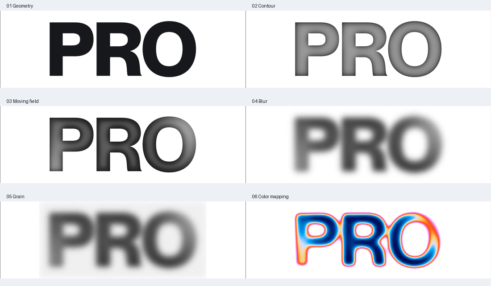
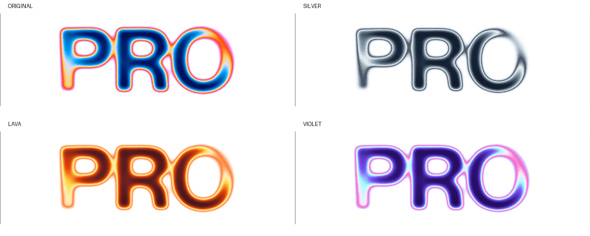

# PRO：把灰度场变成流动材质

这段动效值得研究的地方，是它用稳定的二维字形制造了类似液体和金属的材质错觉。我们可以把它理解为一个小型图像处理程序：**路径提供结构，滤镜生成材质，SMIL 提供时间。**

原视频：1840×1200、60 fps、17.133 秒，无音轨。原作来自 [Mike Bespalov 的帖子](https://x.com/bbssppllvv/status/2104747296671883312)。作者称动画是约 3 KB 的 SVG；帖子没有说明原始体积还是传输压缩体积，不能直接据此比较文件大小。

## 1. 画面里实际发生了什么

先逐帧看画面，再解释实现。以下时间按原视频的帧时间计，抽样间隔 0.5 秒；早期探索用的 fps 重采样图没有作为最终时间依据。

| 视频时间 | 可以观察到的变化 |
|---|---|
| 0–1.0 秒 | 先出现 P，R 的局部随斜向柔软边界浮现。字母的位置固定。 |
| 1.0–2.5 秒 | R 逐渐完整，O 从弧形恢复成闭合轮廓。深蓝中心外依次出现青、浅黄、橙红、洋红。 |
| 2.5–4.0 秒 | 左边的 P 开始被白色区域吞没，消隐沿同一方向向 R 传播。 |
| 4.0 秒以后 | 重复出现“左侧恢复、右侧消退”的循环。录屏中约每 4.5 秒可见相似状态。 |

三个关键观察：

1. **位置稳定。** 没有整体弹跳、旋转或明显路径变形。
2. **颜色贴着轮廓。** 外边缘与字腔内边缘都有同样的色带秩序，像地形等高线。
3. **白色是材质的一部分。** 字体会融入白底，消失边界仍有洋红和橙色残留；这不是简单地把整个字母透明度调低。

“液态”的感觉来自视觉轮廓发生了变化；底层路径并没有变化。我们把某些颜色当成表面边界，因此亮度跨过色表中的白色区间时，会把颜色变化感知成形状变化。

## 2. 核对公开实现后，哪些可以确定

在 [Refero 公开首页](https://refero.design/) 加载的 [应用脚本](https://refero.design/static/js/main.69f1c5f8.js) 中，找到了对应的 PRO 组件，以及包含“You're Pro.”文案的弹窗调用。以下是关键参数的简要记录；这是网页当前部署的组件，无法证明它与发帖录制时的每个字节相同。

| 环节 | 核对结果 |
|---|---|
| 输入 | 固定的 PRO 路径，两层同形状绘制 |
| 内边缘 | 1.5、4.5、9.5 三档模糊，按不同透明度合并 |
| 扫描 | −35° 灰度渐变，周期平移 486 用户单位，循环 4.4 秒 |
| 首次揭示 | 另一个白色透明度渐变，单次运行约 4.39 秒 |
| 后处理 | 白底合成 → 7.3 模糊 → 细噪声相乘 → RGB 查表 |
| 原作未使用 | 这个 PRO 滤镜链中没有位移映射、镜面光照或路径变形 |

所以，最初看到“金属”便猜测 `feSpecularLighting`，会错过这里真正精巧的部分。`feTurbulence` 在原作中主要负责细颗粒，并没有负责液体式位移。

## 3. SVG filter 是什么

普通 SVG 元素描述“画什么”：路径、圆、文字、图像。`<filter>` 则描述“怎样处理已经画出的像素”。每个 `fe*` 元素完成一步处理，`in` 指定输入，`result` 给结果命名，后面的步骤可以继续使用它。它能分支和合并，形成图像处理的数据流。

这意味着 SVG 同时有矢量几何和栅格处理。路径可以按尺寸重新光栅化，滤镜再处理当前分辨率下的图像。不是所有中间结果都保持为数学曲线。[W3C Filter Effects](https://www.w3.org/TR/filter-effects-1/)

本研究的完整链可以按下面的方式阅读：

```text
PRO 的透明度 ─→ 三档模糊与相减 ─→ 灰度轮廓 ─┐
                                            ├→ 灰度字形
移动的斜向重复渐变 ─────────────────→ overlay ┘

灰度字形 + 首次白色揭示层
     ↓
合成到白底 → 模糊 → 乘以轻微颗粒 → RGB 查找表 → 彩色结果
```

可以打开实验室的 01–06 按钮查看这些步骤。中间的“扫描”层看起来相当普通；经过色谱映射后，它才突然变得像液态材料。



## 4. 为什么模糊能制造轮廓，而不是只让字变糊

设字形透明度为 A(x,y)，字内接近 1、字外接近 0；Gσ 表示标准差为 σ 的高斯模糊。

一个内边缘近似为：

```text
Eσ(x,y) = max(A(x,y) − Gσ(A)(x,y), 0)
```

模糊后的透明度在边缘附近向外扩散，原透明度减去它，就留下字形内部的一圈坡度。不同的 σ 对应不同宽度的坡度。

三个尺度合起来，窄层提供近边缘的清晰变化，宽层提供向字内过渡的缓坡。因此色彩既有清楚的轮廓，又不会像硬描边一样呆板。

这里用 `feMerge` 合并半透明黑层，透明度按覆盖关系累积，并不是简单相加。对于三层局部透明度 e₁、e₂、e₃，总透明度可写成：

```text
E = 1 − (1−e₁)(1−e₂)(1−e₃)
```

把这个值翻译成灰度后，就获得有“厚度感”的明暗结构。这仍是一张二维图，并没有真实厚度、法线网格或遮挡求解。

## 5. 为什么白色扫描会产生“熔化”

在本复现中，重复灰度条带由 17 个采样点近似一条平滑波形，色值按下式生成：

```text
stripe(u) = ((1 + cos(2πu)) / 2)^2.2
```

它倾斜放置，再用 `<animateTransform>` 持续平移。周期的两端颜色一致，配合 `spreadMethod="repeat"`，平移一个周期以后图案可以连续接上。

`overlay` 把扫描的亮暗混到固定的轮廓灰度里。经过模糊和颜色查表，亮的地方会进入白色区间，融进背景；稍暗的地方先经过洋红、橙红、浅黄、青色，再进入深蓝。于是出现带彩边的消失边界。

这解释了一个实用结论：**需要动画的可以只是材质的坐标，而不是物体的几何。** 相同的方法能用于章标、粗体标题、封闭图标或有足够笔画厚度的自定义轮廓。

首次揭示和持续循环要分开：首次揭示控制“开场时还没有出现的部分”，重复扫描负责后续一轮又一轮的材质变化。只做循环而漏掉揭示层，会在开头提前出现右侧 O 的残片。

## 6. 真正的关键：一维查找表

`feComponentTransfer` 对每个通道独立映射。灰度输入的 R、G、B 相等，因此三个不同的通道函数可以把同一个亮度翻译成任意一组颜色：[MDN feComponentTransfer](https://developer.mozilla.org/en-US/docs/Web/SVG/Reference/Element/feComponentTransfer)。

```text
输入像素 = (g, g, g)
输出像素 = (TR(g), TG(g), TB(g))
```

实验室用若干色彩锚点生成三条 61 项的表。`type="table"` 在等距采样值之间线性插值；它不是按色名选择预设，也不是把彩虹渐变贴进字形。[MDN tableValues](https://developer.mozilla.org/en-US/docs/Web/SVG/Reference/Attribute/tableValues)

可以把它理解为灰度图的“调色盘”：空间结构来自前面的计算，色彩风格来自这张表。替换表而保留全部几何与动画，就能从彩色热感材质变成冷银、熔岩或电离紫。



注意不要随意删掉 `color-interpolation-filters="sRGB"`：SVG 滤镜的默认计算空间通常是 linearRGB。改变空间会改变中间灰度的数值，原来精心安排的颜色阈值就不再对应同一块区域。

## 7. 颗粒到底做了什么

`feTurbulence` 可程序化生成噪声图；这里采用细尺度的 `fractalNoise`。[MDN feTurbulence](https://developer.mozilla.org/en-US/docs/Web/SVG/Reference/Element/feTurbulence)

我们把噪声的一个通道 N 变成轻微的明暗扰动，乘进柔化后的灰度 S：

```text
H(x,y,t) = S(x,y,t) × (1 − q × N(x,y))
```

q 是颗粒强度。q=0 时整个因子为 1，颗粒消失。因为它在查表之前发生，细小亮度差也可能跨过斜率较大的颜色区间，变成细微色差；这比最后往彩色结果上加一张灰噪声更融入材质。

默认噪声是固定的，运动来自渐变。关闭颗粒，动画仍存在；这也是判断“谁在负责运动”的一个简单实验。

## 8. 扩展实验：让 SVG 真正做更多事

复现默认关闭以下两项，避免混淆原作和新增机制。

| 新增机制 | 做了什么 | 建议观察 |
|---|---|---|
| 流体置换 | 低频噪声驱动 `feDisplacementMap`，在查表前改变灰度场的采样坐标 | 先设 6，再到 18；区别材质错觉与真实像素位移 |
| 浮雕光照 | 对字形透明度做模糊，把它当高度图，经 `feSpecularLighting` 计算并叠加高光 | 用冷银色谱观察边缘高光随光源移动 |

位移映射使用另一张图的通道决定坐标偏移。镜面光照则使用输入 alpha 作为高度图，依据光源与局部表面方向计算高光。这两者的能力与原作的颜色查表不同。[位移规范](https://www.w3.org/TR/SVG11/filters.html#feDisplacementMapElement)、[MDN 镜面光照](https://developer.mozilla.org/en-US/docs/Web/SVG/Reference/Element/feSpecularLighting)

值得继续探索的组合还有：

- `feMorphology` 扩张/腐蚀轮廓，再用差集生成可控宽度的轮廓带。
- 多个圆先模糊，再对 alpha 做阈值，获得相互融合的软团块；这是 gooey / metaball 风格的一条实现路线，不等于物理模拟。
- `feConvolveMatrix` 做边缘检测、锐化或浮雕，再接颜色映射。
- 把独立移动的光照图相加，用少量参数描述多个灯光。
- 把过滤器应用到 `<image>` 或文字，保留同一套材质逻辑，替换输入内容。

“所有潜力”不等于在同一张图里堆满全部滤镜。更有效的方法是把每个中间结果当作可复用的数据：这一步输出的是轮廓、位移场、高度图，还是色彩？明确它的含义，组合才有方向。

## 9. 小文件背后的实际成本

本次默认 SVG 的实测体积是 **6,613 字节，gzip 1,969 字节**。它包含可读结构、独立路径、渐变、滤镜和原生动画，没有嵌入位图、脚本或外部资源。实验室网页的 JS 和说明文字不包含在这个数字里。

文件小是因为描述短，而不是浏览器不用计算：

- 滤镜仍需要中间像素缓冲区；高 DPI 和更大的显示尺寸会增加像素量。
- 模糊、噪声、光照和位移都有成本。不要凭“无 JS”断言流畅度或功耗。
- 缩小 filter 区域能减少工作量，但必须给模糊和位移留足外扩边界，避免裁切。
- 重复噪声层和不必要的 octaves 应按视觉收益取舍。这里默认只有一层细噪声。
- 在真实设备上测量。此次仅验证本机 Chrome，没有把它当作跨设备性能报告。

默认 SVG 的白色底色参与了材质计算，并非透明背景图。需要暗色背景时，不能只把页面 CSS 背景改黑；应同时重新设计输出色谱、底色和 alpha。

## 10. 复现到了哪里，哪里没有完全一致

已复现固定字形上的灰度扫描、等高线式彩色边缘、细颗粒、首次揭示与原生循环；独立 SVG 已验证在禁用 JavaScript 的浏览器上下文中产生不同时间的画面。

字形是重绘的，R 的字腔和腿部、O 的内缘与原作不同；色谱由新锚点重采样，颗粒还受显示尺度与视频压缩影响。对照时采用一次统一的 +0.3 秒起始偏移，而非逐帧任意挑选最像的时刻。录屏和声明周期仍有少量累计差异。

这是一份可修改、可解释的机制复现，没有达到像素一致或完整录屏逐帧一致。具体截图、时间和检查项见 [验证记录](evidence/verification.md)。

## 文件与代码入口

- [交互实验室](index.html)
- [独立动画 SVG](pro.svg)
- [SVG 生成器](renderer.js)
- [滤镜分解图](evidence/pipeline.png)
- [逐帧对照图](evidence/frame-comparison.png)

研究结论：SVG 的优势不是“用旧技术假装三维”，而是能把几何、图像处理和时间写成一个可组合、可阅读、可缩放的描述。对这种标志级尺寸的材质动效，它提供了一条很有表现力的实现路径。
